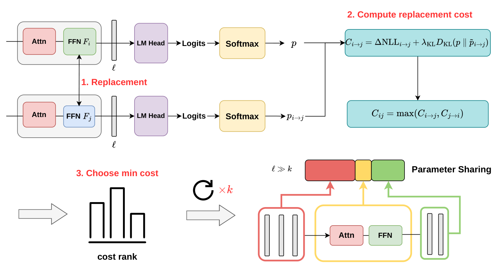
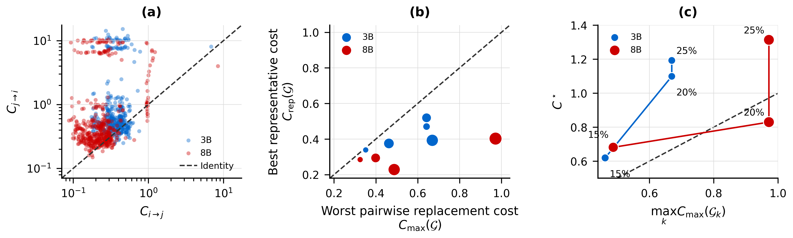

<div align="center">

# Cross-Layer Replacement Sharing for Model Compression
### 以有方向性的全模型替換成本，建立可稽核、可恢復的跨層 FFN 分享結構

[English](README.md) · [論文 PDF](paper/main.pdf) · [論文原始檔](paper/README.md) · [方法](docs/METHOD.md) · [結果](docs/RESULTS.md) · [重現](docs/REPRODUCTION.md) · [外部 baseline 匯入](docs/BASELINES.md)



</div>

---

這個方法不是用權重距離直接決定哪些 layer 可以共用 FFN，而是把 donor
FFN 實際放到 target layer，量測凍結模型的 NLL 與 KL 變化。接著在固定
FFN 儲存數量下，用 complete-link 控制群內最壞替換成本，再依真正的
donor-to-target 方向挑代表 FFN。

這份倉庫以「可稽核研究產物」的方式整理：Ours 的程式、Slurm 工作、
精簡觀測資料、圖片、論文原始檔與驗證器都已納入；Basis Sharing 與
SVD-LLM 的受控 compression、recovery、evaluation、量化程式、設定範本、
Slurm 工作與正式精簡結果也已整理完成。

## 結構驗證圖



論文使用原生 PGFPlots/TikZ 版本。腳本會從
`data/ours/pair_analysis.csv`、`data/ours/group_analysis.csv` 和
`data/ours/joint_analysis.csv` 匯出精簡畫圖資料，再產生
`paper/Figure/structural_validation.pdf`。
Panel (c) 以 $C^\star=C_{\mathrm{joint}}/L$ 表示 normalized joint cost，並與最大
group cost 比較；3B 使用 $L=28$，8B 使用 $L=32$。

在 NCHC 請使用依賴關係完整重產與驗證：

```bash
smoke_job=$(sbatch --parsable slurm/smoke_structural_validation.sbatch)
figure_job=$(sbatch --parsable --dependency="afterok:${smoke_job}" \
  slurm/compile_structural_validation_standalone.sbatch)
paper_job=$(sbatch --parsable --dependency="afterok:${figure_job}" \
  slurm/compile_paper.sbatch)
sbatch --dependency="afterok:${paper_job}" slurm/verify_repository.sbatch
```

## 主要結果

| Backbone | 壓縮目標 | Ours CE+KD | 最強 baseline | 差距 |
|---|---:|---:|---:|---:|
| Llama-3.2-3B | 15% | **84.83 ± 0.47** | 71.28 | +13.55 pp |
| Llama-3.2-3B | 20% | **85.06 ± 0.08** | 68.15 | +16.91 pp |
| Llama-3.2-3B | 25% | **84.09 ± 0.18** | 65.06 | +19.03 pp |
| Llama-3.1-8B | 15% | **86.14 ± 0.33** | 76.43 | +9.71 pp |
| Llama-3.1-8B | 20% | **85.94 ± 0.34** | 73.89 | +12.05 pp |
| Llama-3.1-8B | 25% | **85.92 ± 0.36** | 69.96 | +15.96 pp |

Ours 的 8B--25% W8A16 checkpoint 為 6.50 GiB、86.34% macro accuracy；
相較 dense BF16 儲存量減少 56.53%，與 dense teacher 相差 0.51 個百分點。

## 目前完整度

| 項目 | 狀態 |
|---|---|
| Ours 方法、訓練、評估與分析程式 | **已整理** |
| Ours Pure / CE / CE+KD 資料 | **已整理並由驗證器檢查** |
| 結構分析、normalized joint cost、ablation | **已整理並由驗證器檢查** |
| Basis Sharing / SVD-LLM 受控重現程式 | **已整理** |
| Baseline 設定、Slurm 與量化 pipeline | **已整理** |
| 三方法正式量化資料與圖 | **已整理並由驗證器檢查** |

論文所用量化圖、21 個 source points、per-task accuracy、paired bootstrap
與 packed-byte manifest 都已放入 repo，可由腳本重畫。

## 驗證

一般電腦可直接執行標準函式庫驗證：

```bash
python scripts/verify_repository.py
```

在 NCHC 請一律透過 Slurm：

```bash
sbatch slurm/verify_repository.sbatch
```

驗證器會從 per-task rows 重算 Ours macro mean/SD、檢查
`delta <= Delta`、paired-example 對齊、論文引用、README 連結，以及公開
檔案是否殘留私人路徑或憑證。

## 大型外部產物

若要重新匯入未精簡的逐題 prediction 或大型 checkpoint，可依
[data/external/README.md](data/external/README.md) 的 schema 放入四個 payload：
`predictions.csv`、`byte_manifest.csv`、`quantization.csv`、
`run_manifest.json`，再執行：

```bash
sbatch slurm/import_external_baselines.sbatch
```

完整重現流程與環境變數請看 [docs/REPRODUCTION.md](docs/REPRODUCTION.md)，
檔案導覽請看 [docs/FILE_GUIDE.md](docs/FILE_GUIDE.md)。
